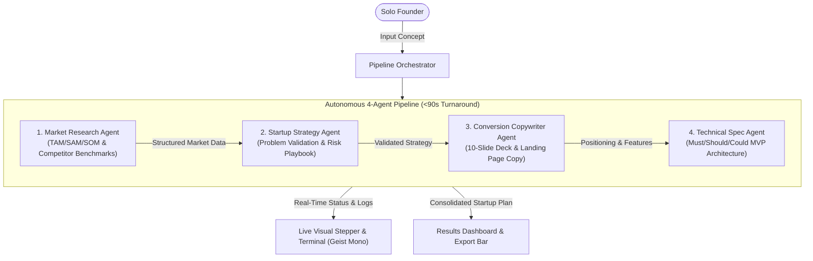

# PitchPilot — Autonomous AI Co-Founder for Solo Founders

> **HackIndia AI-First Startup Hackathon** | Team **CodeByte**  
> *"Built by AI, to help you build with AI."*

PitchPilot is an autonomous multi-agent web application that transforms a single raw startup concept into four comprehensive, investor-grade deliverables in under 90 seconds:

1. **Validation One-Pager**: Quantitative market sizing (TAM / SAM / SOM with explicit public-knowledge assumptions), 3 direct competitors with differentiation vectors, and an execution risk/mitigation playbook.
2. **Interactive 10-Slide Investor Pitch Deck**: A structured presentation (Problem, Solution, Market, Product, Business Model, Roadmap, Defensibility, Team, The Ask) rendered in an in-browser slide viewer with keyboard navigation and print-ready PDF export.
3. **Live Landing Page Preview + React Code**: A complete hero section, value propositions, and CTA rendered live inside a responsive browser mockup (with desktop/mobile viewport toggle), alongside production-ready Next.js / Tailwind TSX code.
4. **AI-Ready MVP Feature Spec**: A prioritized roadmap (Must-have / Should-have / Could-have) where every feature includes a one-sentence technical instruction formatted specifically for AI coding assistants (Cursor, Antigravity, Claude Code).

---

## 1. The Core Thesis: Moving Beyond Chat Wrappers

Most solo founders fail not from lack of ambition, but from **execution fragmentation**. Turning an idea into an investable project typically requires:
- An experienced **analyst** to size markets and map competitors.
- A seasoned **strategist** to pinpoint macro inflection points and surface blindspots.
- A conversion **copywriter** to formulate clear, buzzword-free positioning.
- A technical **architect** to scope a realistic MVP and select the optimal stack.

Generic AI chat interfaces produce unstructured, generic text walls with high hallucination rates and zero persistent artifacts. 

**PitchPilot replaces manual back-and-forth prompts with a coordinated, deterministic multi-agent pipeline.** Each agent operates under a specialized persona with strict input/output contracts, piping validated JSON schemas sequentially from market discovery down to executable code specifications.

---

## 2. Multi-Agent Pipeline Architecture



### Agent Roles & System Prompts

| Agent | Core Responsibility | Input | Structured Output Contract |
| :--- | :--- | :--- | :--- |
| **Market Research Agent** | Market analyst identifying target demographics, calculating TAM/SAM/SOM with explicit methodology, and profiling 3 direct incumbents. | Raw startup idea | Target market definition, TAM/SAM/SOM values + assumptions array, competitor matrix (differentiation, threat level, weakness). |
| **Startup Strategy Agent** | Blunt venture strategist stress-testing problem urgency, identifying *Why Now* catalysts, and designing risk mitigation playbooks. | Idea + Research data | 2-3 sentence problem statement, macro inflection analysis, risk/mitigation matrix, single biggest opportunity, unfair advantage. |
| **Conversion Copywriter Agent** | World-class tech copywriter (Vercel/Linear caliber) generating high-converting slide narratives and web copy with zero buzzwords. | Idea + Strategy data | 10 structured presentation slides (title, subtitle, bullets, takeaway), hero headline (<8 words), subheadline (<20 words), 3 value props, CTAs. |
| **Technical Spec Agent** | Pragmatic CTO translating business requirements into prioritized engineering tickets suitable for AI coding tools. | Idea + Copywriter output | Prioritized Must/Should/Could lists (name, user story, AI-ready technical approach, complexity), recommended tech stack. |

---

## 3. Product Features & Deliverables

### A. Visible Multi-Agent Pipeline (Signature Visual Moment)
Rather than displaying a generic spinner, PitchPilot makes the autonomous agent pipeline completely visible:
- **Live Elapsed Stopwatch**: Real-time counter reinforcing speed and performance.
- **Stage Progression**: Clear visual states (`queued` → `running` → `done`) with pulsing electric-blue indicators.
- **Real-Time Telemetry**: Live captions in Geist Mono showing exactly what each agent is reasoning about at any given second.

### B. Validation One-Pager
- **TAM / SAM / SOM Metrics**: Quantitative market sizing with transparent underlying assumptions (e.g. population sizes, willingness-to-pay benchmarks, CAGR projections).
- **Competitor Differentiation Matrix**: Direct comparison against 3 incumbents, highlighting our core wedge and their blindspots.
- **Risk Playbooks**: High/Medium risk assessments paired with concrete, tactical mitigations.

### C. Interactive 10-Slide Investor Pitch Deck
- **16:9 Presentation Viewer**: Investor-grade typography and slide structure (Vision, Problem, Solution, Market, Product, Business Model, Roadmap, Defensibility, Team, The Ask).
- **Navigation Controls**: Next/Previous arrows, keyboard arrow navigation (`←` and `→`), slide index counter, and jump-to-slide thumbnail strip.
- **Dedicated Print Stylesheet (`@media print`)**: Seamless 1-click export to high-resolution multi-page PDF presentation handouts.

### D. Live Landing Page Preview + Clean Code View
- **Dual Mode Mockup**: Interactive mini landing page rendered inside a browser window with desktop (100%) and mobile (375px) viewport toggles.
- **React TSX Code View**: Production-ready, copy-pasteable Next.js component formatted with Tailwind CSS and Lucide React icons.

### E. AI-Ready MVP Feature Spec
- **Prioritized Roadmap**: Categorized into Must-Have (P0), Should-Have (P1), and Could-Have (P2) tiers.
- **Actionable AI Instructions**: Each feature includes a concise technical approach structured specifically for prompts in Cursor, Antigravity, or Claude Code.
- **1-Click AI Prompt Exporter**: Formats the entire specification as an AI implementation brief ready to feed into any IDE.

### F. Persistent Export Bar
- **Download Deck (PDF)**: Clean browser print-to-PDF layout.
- **Export Spec (Markdown)**: Complete startup blueprint in GFM format.
- **Export Full Bundle (JSON)**: Full structured schema for programmatic integration.

---

## 4. Design System & Craftsmanship

PitchPilot follows Vercel’s design philosophy:
- **Typography**: Geist Sans for UI readability and Geist Mono for data, timestamps, and terminal telemetry.
- **Color Palette**: Dark mode primary (`#0a0a0a`), neutral zinc grayscale, and a single electric accent (`#0070f3`) reserved strictly for active states and primary CTAs.
- **Subtle Surface Aesthetics**: 1px low-contrast borders (`border-zinc-800`), clean cards with hover elevations, and a low-opacity background grid pattern.
- **No Gimmicks**: Avoids generic purple gradients, floating robot clipart, or Comic-Sans-tier emoji clutter — engineered to look and feel like a modern enterprise developer tool.

---

## 5. Technology Stack & Infrastructure

- **Framework**: Next.js 14+ (App Router), React 18, TypeScript (Strict Mode)
- **Styling**: Tailwind CSS, Lucide React icons, Canvas-Confetti
- **AI Engine**: Multi-provider client with automatic fallback:
  - Google Gemini API (`GEMINI_API_KEY` or `AI_API_KEY`)
  - Anthropic Claude API (`ANTHROPIC_API_KEY`)
  - Intelligent precomputed preset datasets for zero-downtime, offline judge demonstrations
- **Security**: `.env.local` strictly gitignored; zero credentials committed to source control.
- **Deployment**: Zero-config Vercel deployment via `vercel.json`.

---

## 6. Local Setup & Quickstart

```bash
# 1. Clone repository
git clone https://github.com/HackIndiaXYZ/ai-first-startup-hackathon-build-a-startup-using-ai-only-codebyte.git
cd ai-first-startup-hackathon-build-a-startup-using-ai-only-codebyte

# 2. Install dependencies
npm install

# 3. (Optional) Configure environment variable
cp .env.example .env.local
# Add your GEMINI_API_KEY or AI_API_KEY

# 4. Start local development server
npm run dev
```

Open [http://localhost:3000](http://localhost:3000) in your browser.

---

## 7. Hackathon Evaluation Summary (AI Usage Deliverable)

### The Meta-Narrative
PitchPilot was built using AI to solve the exact problem solo founders face in AI hackathons: turning raw ideas into investor-ready assets. It acts as an autonomous co-founder that builds the pitch, strategy, code, and roadmap.

### Human-Guided vs. AI-Generated Mapping

| Project Layer | Generation Method | Human Oversight & Guidance Role |
| :--- | :--- | :--- |
| **System Architecture & App Router Code** | **100% AI Generated** (Google DeepMind Antigravity) | Specification design, SLA constraints, component contracts |
| **Multi-Agent System Prompts** | **AI Prompt Engineered** | Defined specialized personas and structured JSON schemas |
| **Design System & UI Tokens** | **100% AI Engineered** | Enforced Vercel visual DNA and Geist typography |
| **Startup Intelligence Presets** | **AI Synthesized** | Curated high-impact verticals (HealthTech, DevTools, FinTech) |
| **Verification & Browser Testing** | **AI Automated** (Browser Subagent) | Validated responsive layouts, keyboard listeners, and exports |
